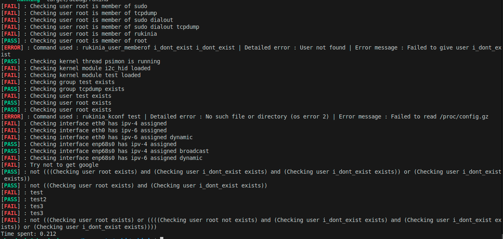

# Rukinia - a Linux firmware validation framework

Rukinia is designed to help Linux-based embedded firmware developers
run simple system-level validation tests on their firmware.

Rukinia integrates well with embedded firmware generation frameworks
such as Buildroot and Yocto, and can be run manually or by your
favourite continuous integration framework.

## Usage

``Rukinia [options] [config file]``

Useful options:

* `help` :  Show help message and exit"
* `config` :    Specify a configuration file (default: config)"
* `shell` :     Shell to manually enter rukinia commands"
* `save-csv` :  Save test result in a CSV file"
    * `custom-path-csv` :  File path of the output file for CSV"

## Screenshot



## Basic config

To run Rukinia, create a configuration describing your tests, and
invoke it. By default, Rukinia reads ``example/rukinia.conf``.

A Rukinia config file supports the following statements:

### Test statements

* ``rukinia_user <username>``: Validates that user exists
* ``rukinia_group <groupname>``: Validates that group exists
* ``rukinia_user_memberof <username> <group...>``: Validate that user is member of groups
* ``rukinia_kmod <kernel module>``: Validates that kernel module is loaded
* ``rukinia_kthread <pname>``: Validates that kernel thread runs
* ``rukinia_http_request <url>``: Validates that url returns a 200 code
* ``rukinia_cmd <command>``: Validates that arbitrary command returns true
* ``rukinia_symlink <link> <target>``: Validate the target of a symlink
* ``rukinia_netif_has_ip <interface> [-4|-6] [flags]``: Validate that interface has ip config parameters
  * example: `rukinia_netif_has_ip eth0 -4 dynamic`
  * example: `rukinia_netif_has_ip eth0 -6 "scope global"`
* ``rukinia_netif_is_up <interface>``: Validate network interface state is up
* ``not``: Can prefix any test to invert the issue it will produce (a
  ``[!]`` is appended to the default test description)
* ``as <string>``: Can prefix any test to change its textual description

### Example rukinia.conf

```shell
rukinia_user_memberof root sudo 
rukinia_user_memberof root tcpdump 
rukinia_user_memberof root sudo dialout
rukinia_user_memberof root sudo dialout tcpdump
rukinia_user_memberof root rukinia
rukinia_user_memberof root root
rukinia_kthread psimon
rukinia_kmod i2c_hid
rukinia_kmod test
rukinia_group test
rukinia_group tcpdump
rukinia_user test
rukinia_user root
rukinia_user root
rukinia_kconf "test"
rukinia_netif_has_ip eth0 
rukinia_netif_has_ip eth0 -6
rukinia_netif_has_ip eth0 -6 dynamic
rukinia_netif_has_ip enp68s0
rukinia_netif_has_ip enp68s0 broadcast
rukinia_netif_has_ip enp68s0 -6 dynamic
rukinia_http_request "https://www.google.com"
not rukinia_http_request "https://www.google.com"
not (((rukinia_user root) and (rukinia_user i_dont_exist) and (rukinia_user i_dont_exist)) or (rukinia_user i_dont_exist))
not ((rukinia_user root) and (rukinia_user i_dont_exist))
not as "test" (rukinia_user root) and ((((not rukinia_user root) and (rukinia_user i_dont_exist) and (rukinia_user i_dont_exist)) or (rukinia_user i_dont_exist)))
as "test2" ((rukinia_user root) or ((((not rukinia_user root) and (rukinia_user i_dont_exist) and (rukinia_user i_dont_exist)) or (rukinia_user i_dont_exist))))
as "tes3" not ((rukinia_user root) or ((((not rukinia_user root) and (rukinia_user i_dont_exist) and (rukinia_user i_dont_exist)) or (rukinia_user i_dont_exist))))
as "tes3" not ((rukinia_user root) or ((((not rukinia_user root) and (rukinia_user i_dont_exist) and (rukinia_user i_dont_exist)) or (rukinia_user i_dont_exist))))
not as "tes4" ((rukinia_user root) or ((((not rukinia_user root) and (rukinia_user i_dont_exist) and (rukinia_user i_dont_exist)) or (rukinia_user i_dont_exist))))
```

## License

`Copyright (C) 2017-2024 Savoir-faire Linux, Inc.`

Rukinia is released under the Apache 2 license.